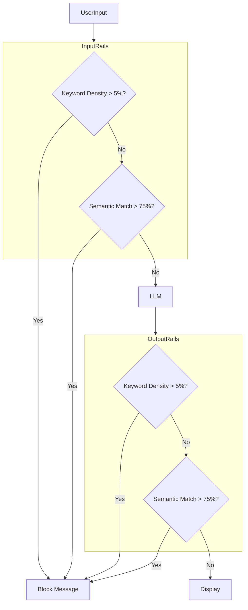

# 🛡️ Hybrid Guardrails System Documentation

## Overview
This system implements a **Hybrid Guardrails Content Filtering System**, inspired by NVIDIA NeMo Guardrails. It combines fast keyword density checks with deep semantic topic filtering to provide dual-layer, bi-directional content protection for the Simple Chatbot.

## Key Features

### 🎯 Dual-Layer Filtering Strategy
1.  **Layer 1: Keyword Density Check (Fast)**
    *   **Speed**: < 1ms
    *   **Mechanism**: Uses `jieba` for precise Chinese/English tokenization.
    *   **Logic**: Blocks if `(Sensitive Words / Total Words)` > Threshold (default 5%).
2.  **Layer 2: Semantic Topic Filtering (Deep)**
    *   **Speed**: ~100-200ms
    *   **Mechanism**: Uses `Sentence Transformers` for semantic similarity.
    *   **Logic**: Blocks if input matches restricted topics (e.g., politics, sensitive religious debates) based on defined examples.

### 🔒 Bi-Directional Protection
*   **Input Rails**: Filters user queries before they reach the LLM.
*   **Output Rails**: Filters LLM responses before they are displayed.

### 🎛️ Dynamic Control
*   **UI Checkbox**: Easily enable/disable Guardrails directly from the Chatbot interface.
    *   ☑ **Enabled**: Full protection (recommended for production/public use).
    *   ☐ **Disabled**: No filtering (useful for research/debugging).

## Architecture


## Quick Start

### 1. Launch the Application
```bash
uv run python main.py
```
Go to the **Simple Chatbot** tab.

### 2. Guardrails Controls
*   **Checkbox**: Located at the top of the chat interface. Toggle to enable/disable protection.
*   **Status Panel**: Expand "🛡️ Guardrails Content Filtering" to view active configurations and topics.

### 3. Run Tests
Verify the system integrity:
```bash
uv run python test_nemo_guardrails.py
```

## Configuration

Configuration files are located in `deep_agent_rag/guardrails/config/`.

### 1. `config.yml` (Main Config)
Controls global settings and thresholds.
```yaml
enabled:
  keyword_filter: true
  semantic_filter: true
  input_rails: true
  output_rails: true

keyword_filter:
  threshold: 0.05           # 5% density
  blocked_keywords: ["keyword1", "keyword2"]
  blocked_message: "Blocked content message..."

semantic_filter:
  similarity_threshold: 0.75
  embeddings:
    model: "sentence-transformers/all-MiniLM-L6-v2"
```

### 2. `rails.txt` (Topic Definitions)
Defines semantic topics using a simplified Colang syntax.
```text
TOPIC: politics
DISPLAY: Politics
EXAMPLES:
  - Who should I vote for?
  - Political scandals
MESSAGE: I cannot discuss political topics.
---
```

## Customization

### Adding Keywords
Edit `config.yml` under `keyword_filter.blocked_keywords`.

### Adding Semantic Topics
Append to `rails.txt`:
```text
TOPIC: new_topic
DISPLAY: New Topic Name
EXAMPLES:
  - Example phrase 1
  - Example phrase 2
MESSAGE: Custom blocking message.
---
```

## Implementation Details
*   **Why Custom?**: Standard `nemoguardrails` had dependency conflicts (langchain/pillow versions). This custom pure-Python implementation resolves those while retaining core functionality.
*   **Performance**:
    *   **Lazy Loading**: Semantic models load only when needed.
    *   **Caching**: Topic embeddings are pre-computed and cached.
    *   **Fast-Fail**: Keyword checks run first (<1ms) to avoid unnecessary semantic computation.

## Programmatic Usage
```python
from deep_agent_rag.guardrails.nemo_manager import get_guardrail_manager

manager = get_guardrail_manager()

# Check Input
should_block, msg = manager.check_input("User query")

# Check Output
should_block, msg = manager.check_output("LLM response")
```

---
**Version**: 2.0 (Hybrid Architecture) | **Last Updated**: 2026-01-13